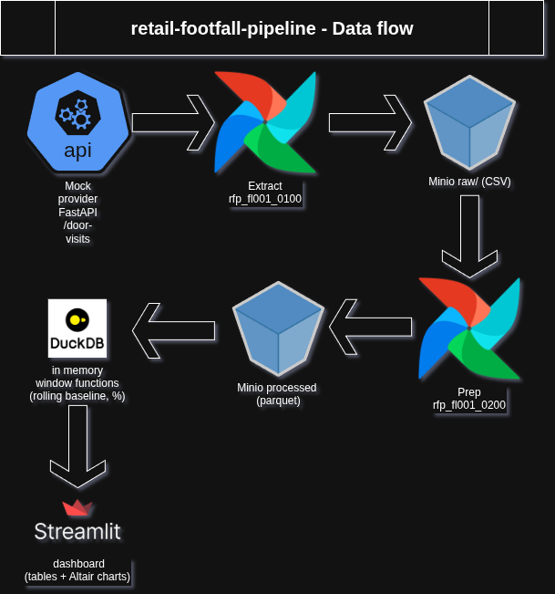

# retail-footfall-pipeline

🇫🇷 [Pitch en français](#pitch-en-français) · 🇬🇧 English below

End-to-end retail data pipeline built to simulate footfall analytics
for a single multi-sensor retail store.

A mock external provider API (FastAPI) generates synthetic hourly
visit data, ingested and orchestrated through an Airflow DAG, stored
as Parquet in MinIO object storage, then analyzed with DuckDB window
functions (rolling weekday baselines, variation thresholds) and
exposed through a Streamlit dashboard.

The pipeline is tested end to end with a real CI/CD flow : GitHub
Actions builds and pushes Docker images, then deploys and runs the
full stack on a VPS for demonstration purposes.

**Stack** : Airflow, FastAPI, MinIO, DuckDB, Pandas, Streamlit,
Docker, GitHub Actions



## Repo structure

```
.
├── .github/
│   └── workflows/
│       ├── cd.yml
│       └── ci.yaml
├── api/
│   ├── __init__.py
│   ├── Dockerfile
│   ├── requirements.txt
│   └── store_api.py
├── dataviz/
│   ├── data/
│   ├── sqlq/
│   ├── __init__.py
│   ├── Dockerfile
│   ├── requirements.txt
│   └── streamlit_app.py
├── etl/
│   ├── data/
│   ├── sqlq/
│   ├── __init__.py
│   ├── Dockerfile
│   ├── requirements.txt
│   ├── rfp_fl001_0100_api_csv_extract_data.py
│   └── rfp_fl001_0200_csv_parquet_data_prep.py
├── orchestration/
│   ├── dags/
│   ├── logs/
│   ├── Dockerfile
│   └── requirements.txt
├── sandbox/
├── src/
│   ├── sensor/
│   │   ├── __init__.py
│   │   └── sensor.py
│   ├── __init__.py
│   └── rfp_config.py
├── tests/
│   └── test_sensor.py
├── .env
├── .env_docker
├── .gitignore
├── docker-compose.yml
├── Makefile
├── pyproject.toml
├── README.md
└── requirements.txt
```


## Local install

Prerequisites : Docker, Docker Compose, and `make`.

1. Copy `.env` and `.env_docker` from their example files (or create
   them) at the project root, filling in the required variables :
   `make setup` fails fast if either file is missing.
2. Run `make setup`. This runs the full local bootstrap in one go :
   validates the env files, creates the local log/dags directories
   with correct permissions, creates the `airflow-net` Docker
   network, migrates the Airflow metadata DB, builds the ETL image,
   then starts the full stack locally, including MinIO via the
   `local` profile.
3. Run `make password` to retrieve the auto-generated Airflow admin
   password (retries a few times if `api-server` isn't ready yet).
4. Access the stack :
   - Airflow UI : `http://localhost:${AIRFLOW_PORT}`
   - Streamlit dashboard : `http://localhost:8501`
   - MinIO console : `http://localhost:9106`

### Environment variables

| Group | Variables |
|---|---|
| MinIO | `MINIO_ROOT_USER`, `MINIO_ROOT_PASSWORD`, `MINIO_ENDPOINT`, `MINIO_BUCKET` |
| Postgres | `POSTGRES_USER`, `POSTGRES_PASSWORD`, `POSTGRES_DB` |
| Airflow | `AIRFLOW_VERSION`, `AIRFLOW_PYTHON_VERSION`, `AIRFLOW_PORT`, `AIRFLOW_ADMIN_USER`, `AIRFLOW_ADMIN_EMAIL`, `AIRFLOW_JWT_SECRET` |
| API / app | `PYTHON_VERSION`, `APP_PORT`, `HOST_PORT`, `API_BASE_URL` |
| Pipeline | `DATA_LOAD_MOD`, `DATA_LOAD_DELTA`, `DATA_LOAD_INIT_DATE`, `FILE_PATH_RAW_DATA`, `FILE_PATH_INTER_DATA`, `FILE_PATH_PRO_DATA`, `DEBUG`, `ENVIRONMENT` |

Useful commands during development :
- `make logs` : tail logs for all running services
- `make ps` : quick status check on all services
- `make reload-streamlit` : rebuild and restart only the Streamlit
  container, without touching the rest of the stack
- `make down` : stop and remove containers (volumes are kept)

## Architecture

### Configuration & MinIO access (`rfp_config.py`)

Centralized settings are loaded via `pydantic-settings`, validated
at import time so a missing environment variable fails fast at
startup rather than mid-pipeline. A shared workspace context manager
provides a persistent local working directory per pipeline run,
avoiding round-trips through MinIO between ETL steps. Dedicated
helpers wrap a boto3 S3 client to upload, download, and list files
in the MinIO bucket, used consistently across the extract and prep
scripts.

### Data simulation (NumPy)

Visit data is synthetically generated by the `AttendanceSensor`
class, which simulates hourly door passages from 8am to 7pm using a
NumPy normal distribution, with hourly weighting to mimic realistic
traffic patterns (quieter mornings, lunch peak, evening rush). The
store is closed on Sundays. A date-derived random seed keeps results
reproducible for a given day, and random hourly dysfunctions
(reduced count) or breakdowns (missing count) are simulated on top
to reproduce real sensor unreliability.

### Mock provider API (FastAPI)

A FastAPI app (`store_api.py`) simulates an external data provider,
exposing two endpoints : `/door-health` for liveness checks and
`/door-visits` for hourly visit data by date and door name (north,
south, east, west). Input is validated for unknown doors, invalid
date formats, and Sunday requests (store closed), each returning a
400 response with an explicit error message.

### ETL pipeline & orchestration (Airflow)

The pipeline runs as a two-task Airflow DAG (`rfp_fl001_0000_api_parquet_main`),
each step running as an isolated Docker container via `DockerOperator`,
scheduled daily and without catchup :

1. **Extract** (`rfp_fl001_0100_api_csv_extract_data`) : queries the mock
   provider API day by day for each sensor, skips Sundays, and writes one
   CSV per month to MinIO. Supports a full `INIT` load from a configurable
   start date, or a `DELTA` load limited to the current month.
2. **Prep** (`rfp_fl001_0200_csv_parquet_data_prep`) : runs in a separate
   container with no shared filesystem, so it first downloads the raw CSVs
   from MinIO, merges them into a single DataFrame, then applies the SQL
   transformations to produce interim and processed Parquet files.
   Each run upserts into the existing Parquet output and deduplicates on
   its key columns, so re-running a day doesn't create duplicate rows.

### External SQL files

Transformation queries live in standalone `.sql` files (`sqlq/`)
rather than inline Python strings, read and executed by
`generate_parquet`. This is a deliberate habit : keeping the SQL
external makes it directly portable into any DBMS client for manual
inspection or debugging, and lets it be pulled and run independently
from an external Python command, without touching the pipeline code.

### Why Parquet

Parquet is used as the intermediate storage format in MinIO to make
data easily accessible through a bucket, with a compressed columnar
format that DuckDB can read directly, without any extra conversion
step.

### Dashboard (Streamlit)

`streamlit_app.py` visualizes the processed Parquet data with DuckDB
and Altair. On load, it pulls the latest `dm_fact_visits.parquet`
from MinIO, cached for one hour, and re-reads it only when the file's
mtime changes. The user picks a door sensor and a week, and gets a
side-by-side view of door-level vs store-level daily visits, rolling
average, and percentage change, as tables and matching bar charts.

## Data quality & design decisions

Quick notes on choices in `rfp_fl001_0200_csv_parquet_data_prep.py` that aren't obvious
from the SQL alone.

- **`VISITS_NUM` defaults to 0, not NULL** : intentional, so a
  sensor with missing data shows up as a real drop in the sums and
  rolling averages below, instead of being silently excluded.
- **`PCT_CHANGE_NUM` returns NULL, not 0, when there's no valid
  baseline** (warm-up period or a genuine zero average). Avoids
  reporting a fake "no change".
- **Rolling window (`ROWS BETWEEN 4 PRECEDING AND 1 PRECEDING`)**
  assumes fixed sensors with continuous data. Since this models a
  single store with a fixed, known sensor set, sensors never appear
  or disappear mid-stream. A data gap would still silently skew the
  window if it ever occurred, and would need a date-based frame to
  guard against it.
- **Total visits count is a plain sum, always accurate.** Only its
  baseline average is a sum of per-sensor averages rather than a
  fresh average on an aggregated total, valid only while sensors
  stay fixed and aligned on the same dates, which holds here for the
  same single-store, fixed-sensor reason.

## Testing & CI

### Tests (unittest)

`test_sensor.py` covers `AttendanceSensor` with `unittest`. It checks
that weekdays return real hourly data, that Sundays return the
closed-store sentinel, and that forcing `pct_breakdown`/
`pct_dysfunction` to 10 (always triggers) correctly produces a `None`
visit count on breakdown and a reduced, fixed expected value on
dysfunction, using the date-derived seed for deterministic results.

### CI checks

Every push runs `black --check .`, `pylint`, `mypy --strict .`, and
the unit tests, so formatting, lint, and type errors are caught
before a merge, alongside the test suite above.

## Naming conventions

### Files

| Suffix | Meaning | Example |
|---|---|---|
| `_ID`   | Identifies the row's granularity (key component) | `SENSOR_ID`, `DATE_ID`, `HOUR_ID` |
| `_NUM`  | Measured number / metric | `VISITS_NUM` |
| `_CD`   | Code | `STATUS_CD` |
| `_DESC` | Description | `DOOR_NAME_DESC` |
| `_DT`   | Date | `OPEN_DT` |
| `_TS`   | Timestamp | `TEC_CREATION_TS` |
| `TEC_`  | Technical field added by the pipeline, not from source | `TEC_CREATION_TS` |

Raw row granularity : `DATE_ID + SENSOR_ID + HOUR_ID`, one row per
sensor, per date, per hour slot. `HOUR_ID` identifies the slot, it
isn't a measured metric, hence `_ID` rather than `_NUM`.

### Workflows & scripts

Workflow and script names follow a fixed structure :
`<project>_<flow>_<step>_<source>_<target>_<short_description>`

- `rfp` : project trigram
- `fl001` : flow number (flow #1)
- Step code : `0000` for the DAG entry point, `0100` for a sub-flow
  of the main, `0110` for a sub-flow of `0100`, `0111` for a sub-flow
  of `0110`, and so on
- `<source>` / `<target>` : trigrams identifying the input and output
  systems (e.g. `api`, `csv`)
- Trailing text : short free-form description of what the step does

Example : `rfp_fl001_0100_api_csv_extract_data` reads from the API
and writes CSV, as the first sub-step of flow `fl001_0000`.

## Deployment (Docker, Makefile, CD)

The stack is fully containerized via Docker Compose : MinIO (local
dev only, external in prod), the mock provider API, Postgres and the
three Airflow components (API server, scheduler, DAG processor), and
Streamlit. The ETL image is built separately and never runs as a
standing container, it's only invoked on demand by Airflow's
`DockerOperator` through the scheduler's Docker-outside-of-Docker
socket mount.

DAGs are exposed to Airflow through a dedicated `orchestration/dags`
folder, populated with symlinks pointing back to each pipeline's own
DAG file across their respective project folders. This centralizes
what Airflow scans without duplicating or relocating any DAG code.

A `Makefile` wraps the full lifecycle : `make setup` for a one-shot
local bootstrap (env checks, permissions, network, DB migration, ETL
image build, MinIO), `make up`/`make up-local` to start the stack in
prod or local mode, and `make deploy` to rebuild the ETL image,
ensure the MinIO bucket exists, and reload Streamlit on the VPS.

CD runs via GitHub Actions on every pull request merged into `main`,
connecting to the VPS over SSH (`appleboy/ssh-action`) to trigger the
deployment, which runs `make deploy` on the remote host.

## Pitch en français

Pipeline de données retail end-to-end, conçu pour simuler l'analyse
de fréquentation sur un magasin unique équipé de plusieurs capteurs.
Une API mock (FastAPI) génère des données de visites horaires
synthétiques, orchestrées par un DAG Airflow, stockées en Parquet
dans MinIO, analysées avec des window functions DuckDB (moyennes
glissantes, seuils de variation), puis visualisées dans un dashboard
Streamlit. Le tout tourne en containers Docker avec un vrai flow
CI/CD (GitHub Actions) déployé sur un VPS.

Projet construit pour démontrer une maîtrise de bout en bout d'un
pipeline de données : orchestration, qualité de données, tests,
conventions de nommage, containerisation et déploiement continu.